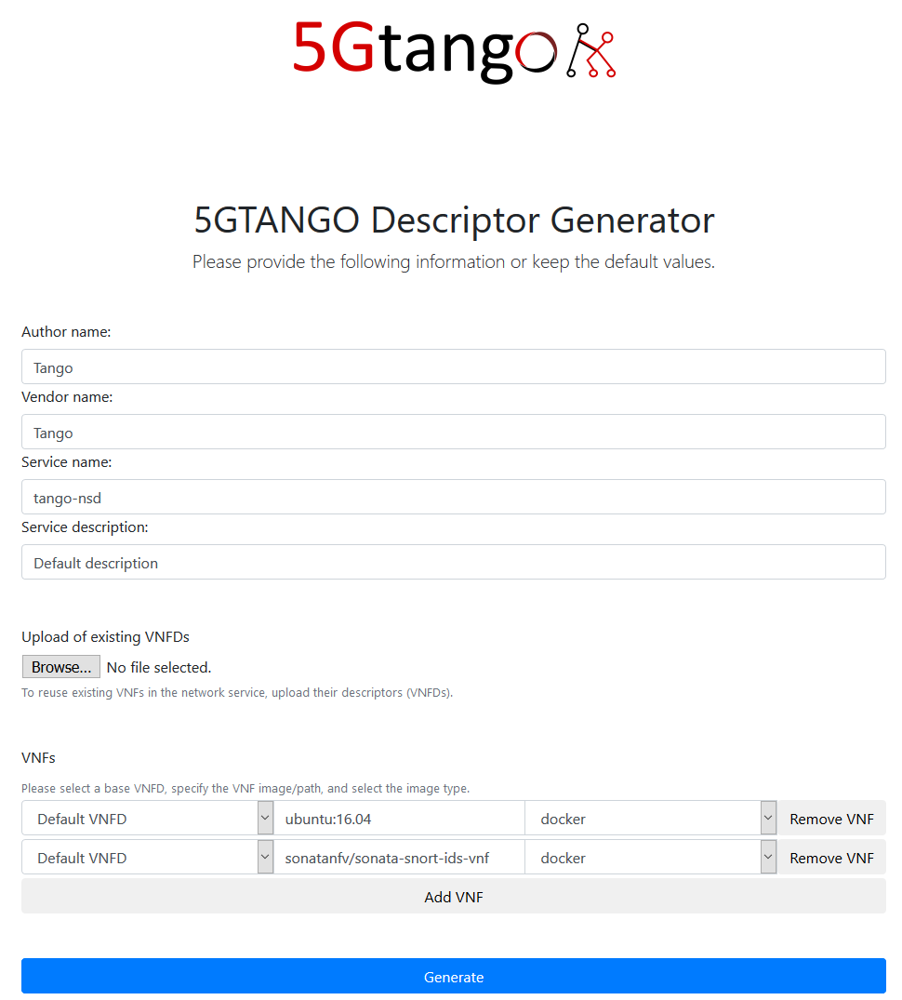
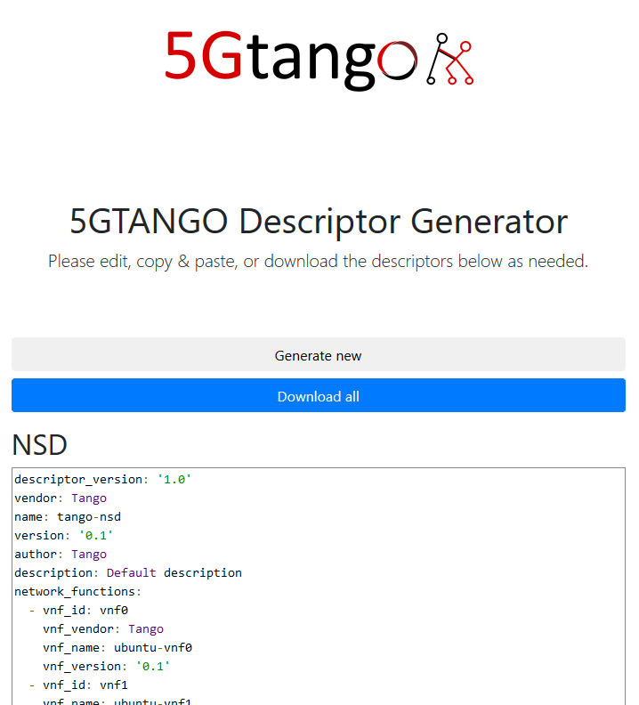

# 5GTANGO Descriptor Generator
The descriptor generator provides a simple web-based GUI that allows to setup and generate correct descriptors (VNFDs and NSDs). The generator uses provided information or assumes default values if no information is provided. This allows the generation of descriptors with a single click.

The resulting VNFDs and NSDs can still be modified as needed.

## Installation and usage

Simply download the repository and open `index.html` in a web browser (tested with Firefox 58).

## Docker deployment

If you want to deploy the descriptor generator as a docker container, you can do so using the `Dockerfile`. The container will run a nginx webserver serving the descriptor generator. Simply download the repository and run from within:
* `docker build -f Dockerfile -t tng-sdk-descriptorgen:latest .` to create the docker image
* `docker images` to check that the image is there
* `docker run -d -p 80:80 --name descriptorgen --rm tng-sdk-descriptorgen:latest` to start the docker container
* `docker container ls` to check that the container is running
* Open localhost in your web browser to access the descriptor generation web interface
* `docker stop descriptorgen` to stop the container

`DockerfilePipeline` is just used for the Jenkins pipeline.

## Tests

To test that everything is working correctly, you can use the provided unit tests in the `pipeline/unittest` directory. The tests use the [Protractor testing framework](http://www.protractortest.org/#/), which can be installed using

* `npm install -g protractor`
* `sudo webdriver-manager update`

Protractor needs Java, which can be installed using `sudo apt-get install default-jdk` on Ubuntu.
Once installed, the unit tests can be executed with

* Terminal 1: `sudo webdriver-manager start`
* Terminal 2 (inside the `pipeline/unittest` directory): `protractor conf.js`

This triggers the tests using Chrome in headless mode. Terminal 2 informs about the test progress and success. If and only if all tests finish successfully, `protractor` exits with code 0.

## Workflow
### Input

The web interface asks for high-level information about the network service such as author and service name. For all fields, default values are provided to support the easy and fast generation of new descriptors. Clicking the "Generate" button triggers the generation of the descriptors.

### Output

The generated descriptors are directly shown in code boxes that allow further manual adjustments and that provide yaml code highlighting. Once satisfied with the result, the descriptors can be downloaded individually or bundled together in a zip file.

## Development and contribution

Please check or create [issues](https://github.com/sonata-nfv/tng-sdk-descriptorgen/issues) matching the current and future development steps.

Contribution is very welcome! Please, fork the repository and create pull requests to submit implemented features. Make sure all unit tests pass before creating a pull request.

**TODO: Comments after Aveiro F2F**

* support specifying high-level information in some kind of meta-descriptor that can be compiled into descriptors via command line --> more comfortable for advanced users who don't want to use the web interface
* specify min/max number of VNFCs per VDU
* allow to specify multiple VDUs per VNF?
* Other types of descriptors?
  * Test descriptors
  * Policy descriptors (eg, placement constraints)
* ensure consistency with specific schema version
